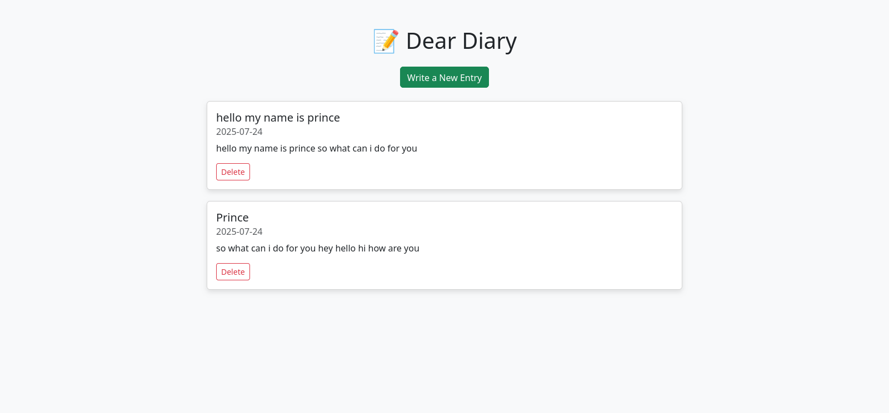
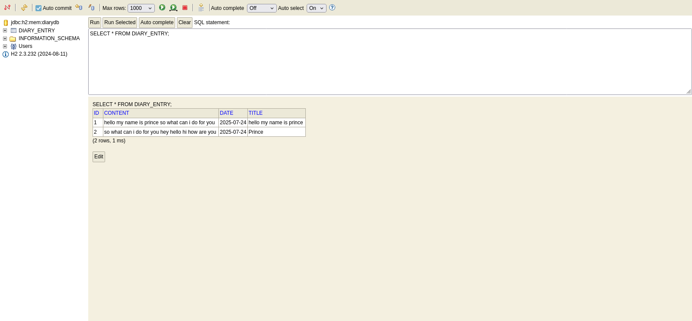

# 📔 Dear Diary

A simple, elegant web-based diary application built using **Spring Boot**, **Thymeleaf**, and an **H2 in-memory database**.

---
## 🖼️ Screenshots

### ✏️ Diary Entry Page



---

### 📜 All Entries View



---

## ✨ Features

* ✍️ Write new diary entries
* 📖 View and delete entries
* 💻 Responsive interface using Bootstrap
* 🛢️ Built-in H2 database with web console access

---

## 🚀 Getting Started

### 🔧 Prerequisites

* Java 17+
* Maven

---

### ▶️ Run the Application

Use Maven wrapper:

```bash
./mvnw spring-boot:run
```

Then open your browser:

* **🌐 Main App:** [http://localhost:8080/](http://localhost:8080/)
* **🛠️ H2 Console:** [http://localhost:8080/h2-console](http://localhost:8080/h2-console)

---

## 🧾 H2 Database Console

* **JDBC URL:** `jdbc:h2:mem:testdb`
* **Username:** `prince`
* **Password:** `prince`

### 📊 View All Diary Entries

In the H2 console, run the following SQL command:

```sql
SELECT * FROM DIARY_ENTRY;
```

This will display all the diary entries currently stored in the in-memory database.

---

## 📁 Project Structure

```
deardiary/
├── src/
│   ├── main/
│   │   ├── java/com/diary/deardiary/
│   │   │   ├── controller/          → Contains `DiaryController.java`
│   │   │   ├── model/               → Contains `DiaryEntry.java`
│   │   │   ├── repository/          → Contains `DiaryEntryRepository.java`
│   │   │   └── DeardiaryApplication.java
│   │   └── resources/
│   │       ├── templates/           → Thymeleaf HTML files: `form.html`, `index.html`
│   │       ├── static/              → (Optional static files: CSS/JS if added)
│   │       └── application.properties
│   └── test/java/com/diary/deardiary/
│       └── DeardiaryApplicationTests.java
├── data/                            → (Optional H2 database file if persisted)
├── README.md
├── pom.xml

```

---


## 📄 License

This project is licensed under the **Apache License 2.0**.
Feel free to use and modify it for personal or educational purposes.

# DearDiary-JAVA_springboot_hybernet
